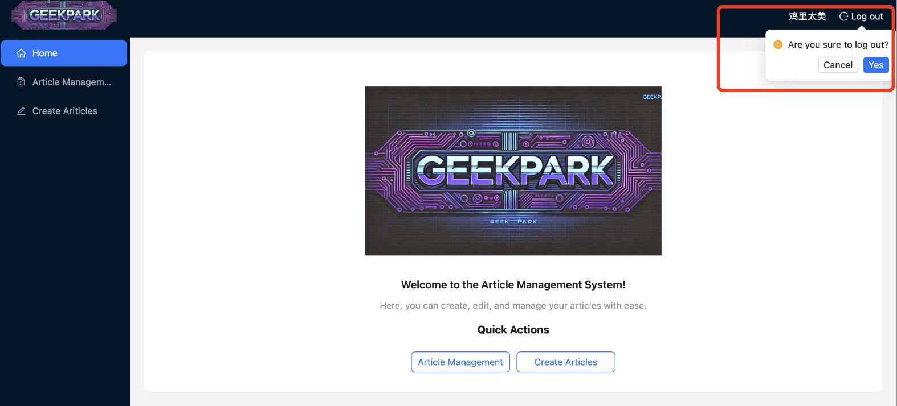
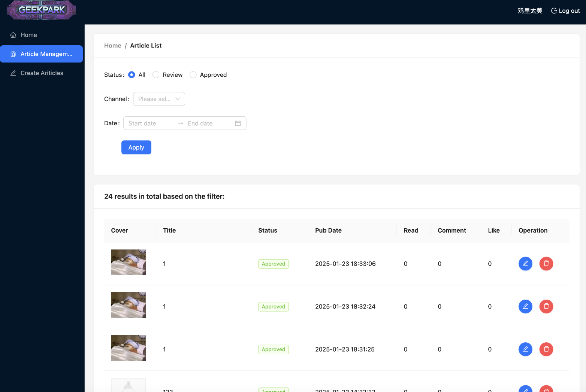
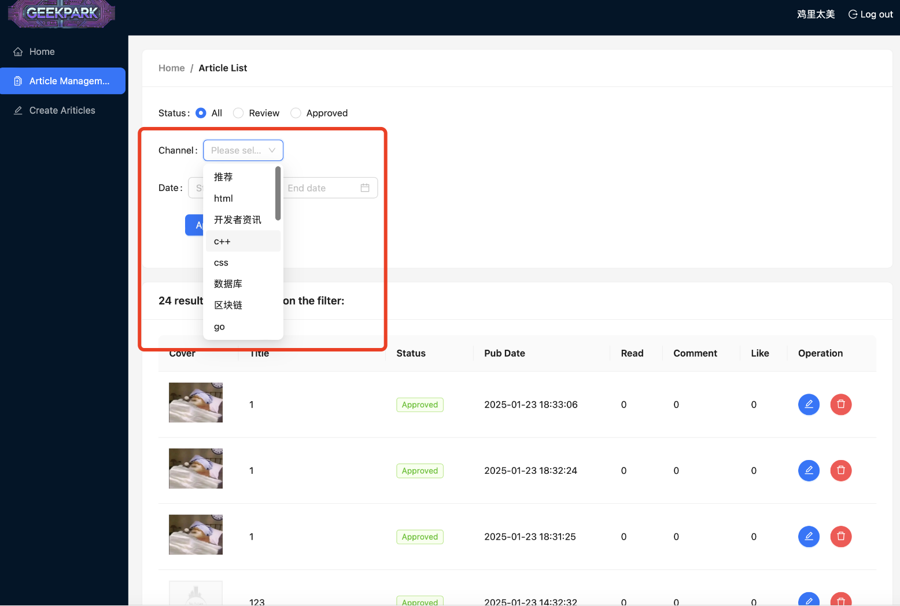
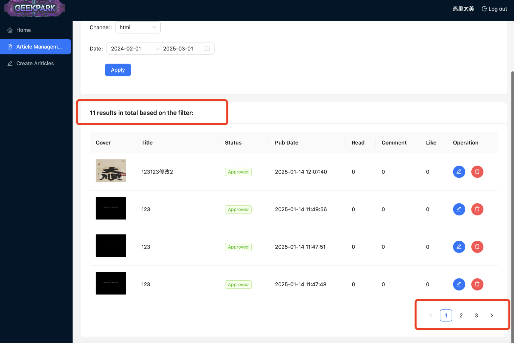
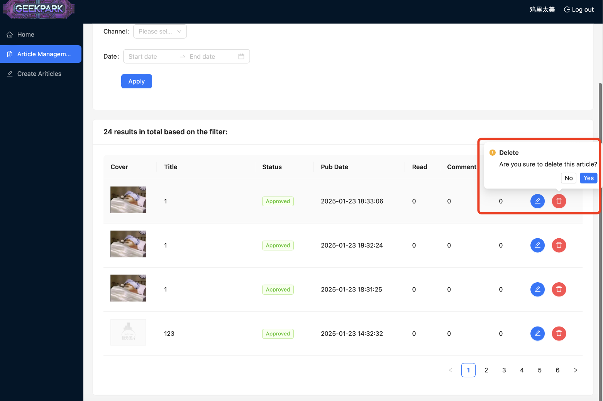
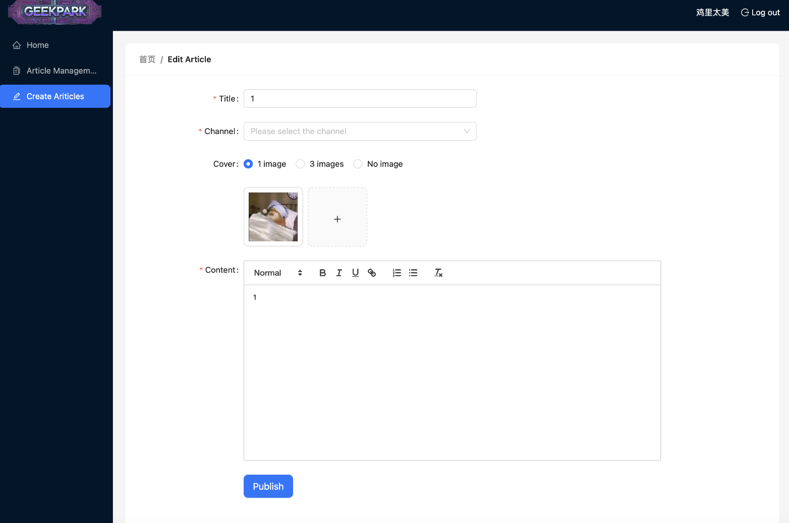
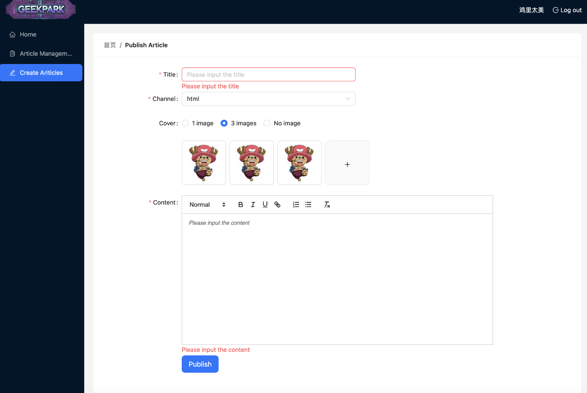
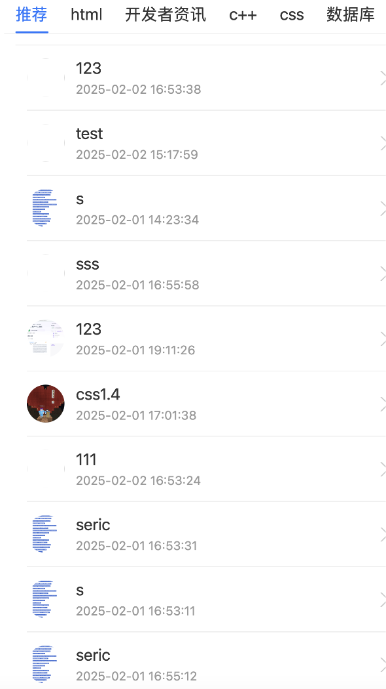

# GeekPark

A React-based management system for efficiently managing users, articles, and data dashboards. 

# To Start the GeekPark PC Program

```bash
npm start

```

# To Start the GeekPark Mobile Program

```bash
npm run dev

```

# Introduction of features

### Login Page with Validation Rules

### Home Page and Log-out 

### Article Management Page

### Select Channel

### Select Date

### Apply Filter Result and Show Paginator

### Delete Articles

### Edit Article and Data Echo

### Create New Articles with Validation and Choose Covers



### Mobile Page showing channel list and article list

### Mobile Page article content


